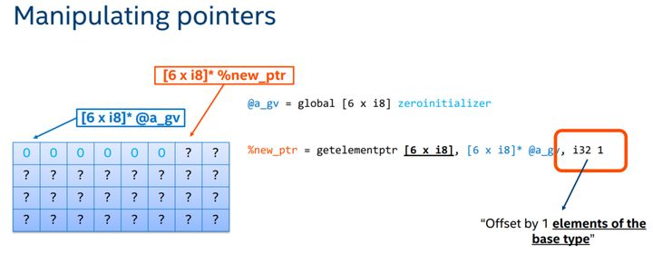
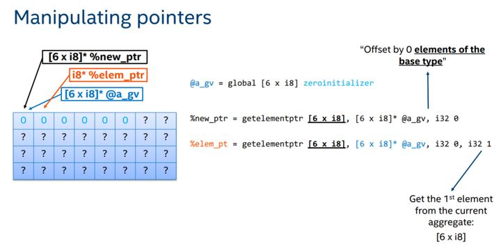

# Lab 7 实验指导

## 理解 `getElementPtr` 指令

在你准备动手写这个 lab 之前，我们**强烈建议**你先自己写几个带有数组的程序并自己编译为 LLVM IR 看一下不同情况下 clang 是怎么做的，不然你可能会对 `getElementPtr`（下面简称为 GEP) 这个指令感到迷惑。如果你看完实验指导并且生成了自己的代码之后还是有疑问，可以浏览 [这里](https://llvm.org/docs/GetElementPtr.html)。

LLVM 的指针操作 GEP 指令几乎是所有指针计算的关键。

GEP 指令的工作是“计算地址”，本身并不进行任何数据的访问和修改。GEP 指令的最基本语法为 `<result> = getelementptr <ty>, <ty>* <ptrval>, {<ty> <index>}*`，其中第一个 `<ty>` 表示第一个索引所指向的类型，第二个 `<ty>` 表示后面的指针基址 `<ptrval>` 的类型，`<ty> <index>` 表示一组索引的类型和值。要注意索引的类型和索引指向的基本类型是不一样的，索引的类型一般为 `i32` 或 `i64` ，而索引指向的基本类型确定的是增加索引值时指针的偏移量。

第一个索引不会改变返回的指针的类型，也就是说 `ptrval` 前面的 `<ty>*` 对应什么类型，返回就是什么类型；第一个索引的偏移量的是由第一个索引的值和第一个 `ty` 指定的基本类型共同确定的。



上图中第一个索引指向的基本类型是 `[6 x i8]`，索引值是 1，所以 GEP 指令返回的值相对基址 `@a_gv` 前进了 6 个字节。由于只有一个索引，所以返回的指针也是 `[6 x i8]*` 类型。

而对于后面的索引，每增加一个索引，就会使得该索引使用的基本类型和返回的指针的类型去掉一层。



上图中 `%elem_ptr = getelementptr [6 x i8], [6 x i8]* @a_gv, i32 0, i32 1` 这一句中第一个索引值是 0，指向的类型是 `[6 x i8]`，因此其使返回的指针先前进 0 x 6 个字节，也就是不前进。第二个索引的值是 1，使用的基本类型就是 `i8`（`[6 x i8]` 去掉左边的 6），因此其使返回的指针前进一个字节，返回的指针类型为 `i8*`。

GEP 指令对于新上手的程序员来说比较难理解，所幸我们实验中涉及到指针计算的部分只有数组，而且高维数组可以用一个一维数组来模拟，比如一个 `[4][5]` 的二维数组，我们可以用一个 `[20]` 的一维数组来模拟，这就极大的减少了我们的工作量。

下面对数组 `a[5][4]` 中使用 GEP 指令计算 `a[2][3]` 的地址，给出几个使用 GEP 指令的示例：

```llvm
; 1
@a = global [5 x [4 x i32]] zeroinitializer
%1 = getelementptr [5 x [4 x i32]], [5 x [4 x i32]]* @a, i32 0, i32 2, i32 3 ; %1 类型为 i32*

; 2
@a = global [5 x [4 x i32]] zeroinitializer
%1 = getelementptr [5 x [4 x i32]], [5 x [4 x i32]]* @a, i32 0, i32 2  ; %1 类型为 [4 x i32]，可以理解为 C 语言中指向长度为 4 的一维数组基址的指针
%2 = getelementptr [4 x i32], [4 x i32]* %1, i32 0, i32 3 ; %2 类型为 i32*

; 3
@a = global [5 x [4 x i32]] zeroinitializer
%1 = getelementptr [5 x [4 x i32]], [5 x [4 x i32]]* @a, i32 0, i32 0  ; %1 类型为 [4 x i32]
%2 = getelementptr [4 x i32], [4 x i32]* %1, i32 2, i32 3 ; %2 类型为 i32*

; 4
@a = global [20 x i32] zeroinitializer
%1 = mul i32 2, 4
%2 = add i32 %1, 3
%3 = getelementptr [20 x i32], [20 x i32]* @a, i32 0, i32 %2 ; %3 类型为 i32*

; 5
@a = global [20 x i32] zeroinitializer
%1 = getelementptr [20 x i32], [20 x i32]* @a, i32 0, i32 0 ; %1 类型为 i32*
%2 = mul i32 2, 4
%3 = getelementptr i32, i32* %1, i32 %2 ; %3 类型为 i32*
%4 = getelementptr i32, i32* %3, i32 3 ; %4 类型为 i32*
```
